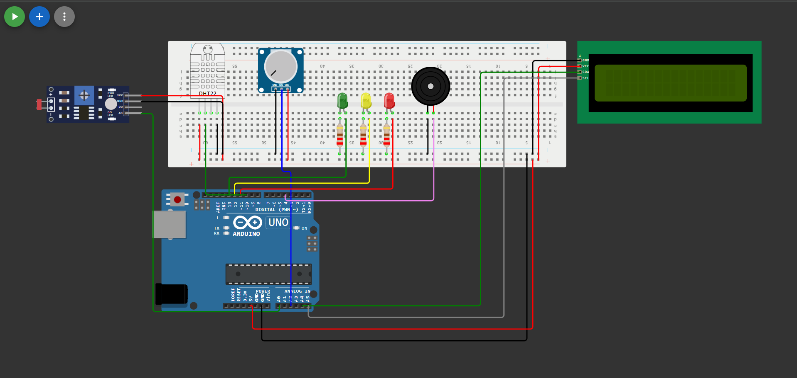

# Sistema de Monitoramento para Vinheria

## 📖 Descrição do Projeto

Este projeto tem como objetivo desenvolver um sistema de monitoramento ambiental para uma vinheria fictícia, utilizando Arduino.
O sistema foi projetado para acompanhar condições críticas que influenciam diretamente a qualidade do vinho, como:

- Luminosidade
- Temperatura
- Umidade

A solução realiza a leitura desses dados em tempo real e fornece feedback visual, sonoro e informativo, permitindo o controle do ambiente.

---

## 🍷 Situação Problema

A qualidade do vinho é diretamente influenciada pelas condições do ambiente onde ele é armazenado.

Inicialmente, o projeto monitorava apenas a **luminosidade**, já que a exposição à luz pode causar alterações químicas no vinho.

Com a evolução do projeto, foram adicionados novos requisitos:

- Controle de **temperatura**, evitando variações que prejudiquem o vinho  
- Controle de **umidade**, evitando ressecamento da rolha ou proliferação de fungos  

Dessa forma, o sistema passou a ter como objetivo:

> Monitorar múltiplas variáveis ambientais e alertar sempre que alguma delas estiver fora do padrão ideal.

---

# 📸 Preview do projeto

---

## 🎯 Fatores Monitorados

- 🔆 Luminosidade (LDR)  
- 🌡️ Temperatura (DHT22)  
- 💧 Umidade (DHT22)  

---

## ⚙️ Funcionalidades Implementadas

- Leitura contínua dos sensores  
- Cálculo de média de leituras  
- Exibição de dados no display LCD  
- Alternância automática entre telas  
- Sistema de alertas com LEDs  
- Alerta sonoro com buzzer  
- Monitoramento via Serial  

---

## 🧩 Componentes Utilizados

- Arduino Uno  
- LDR (sensor de luminosidade)  
- DHT22 (sensor de temperatura e umidade)  
- Display LCD I2C (16x2)  
- LEDs (verde, amarelo, vermelho)  
- Buzzer  
- Resistores  
- Protoboard  

---

## 🖥️ Implementação do LCD

O display LCD foi utilizado para fornecer feedback visual ao usuário.

### Funcionamento:
- Alterna automaticamente entre 3 telas:
  1. Luminosidade  
  2. Temperatura  
  3. Umidade  

- Atualização ocorre a cada **5 segundos**  
- Exibe tanto mensagens de status quanto valores numéricos  

---

## 🌡️ Implementação do DHT22

O sensor DHT22 foi utilizado para medir:

- Temperatura (°C)  
- Umidade (%)  

### Características:
- Sensor digital  
- Utiliza biblioteca específica do Arduino  
- Leituras passam por validação para evitar erros  

---

## 🧠 Lógica de Funcionamento (Baseada nos Requisitos)

### 🔆 Luminosidade

- Ambiente **escuro**  
  → LED verde aceso  

- Ambiente em **meia luz**  
  → LED amarelo aceso  
  → Display mostra “Ambiente a meia luz”  

- Ambiente **muito claro**  
  → LED vermelho aceso  
  → Display mostra “Ambiente muito claro”  
  → Buzzer ligado continuamente  

---

### 🌡️ Temperatura

- Entre **10°C e 15°C**  
  → Display mostra “Temperatura OK”  
  → Valor exibido  

- Acima de **15°C**  
  → Display mostra “Temp. Alta”  
  → LED amarelo aceso  
  → Buzzer ligado  

- Abaixo de **10°C**  
  → Display mostra “Temp. Baixa”  
  → LED amarelo aceso  
  → Buzzer ligado  

---

### 💧 Umidade

- Entre **50% e 70%**  
  → Display mostra “Umidade OK”  
  → Valor exibido  

- Acima de **70%**  
  → Display mostra “Umidade Alta”  
  → LED vermelho aceso  
  → Buzzer ligado  

- Abaixo de **50%**  
  → Display mostra “Umidade Baixa”  
  → LED vermelho aceso  
  → Buzzer ligado  

---

### 🔄 Leitura e Atualização

- São realizadas **5 leituras consecutivas** dos sensores  
- O sistema calcula a **média** dessas leituras  
- Os valores são atualizados a cada **5 segundos**  
- Isso garante maior estabilidade e precisão  

---

### 🔊 Sistema de Alertas

- LEDs indicam o estado do ambiente  
- Buzzer é acionado sempre que houver condição crítica  
- Permanece ativo enquanto o problema não for corrigido  

---

## 💻 Exemplo de Saída Serial
======== STATUS ========

LDR raw: 450

Luminosidade: 65%

Temperatura: 14.2 C

Umidade: 62.5 %

---

## ⚠️ Dificuldades Encontradas

Durante o desenvolvimento, foram enfrentadas algumas dificuldades importantes:

- Implementação da lógica com múltiplas condições simultâneas  
- Integração de diferentes sensores  
- Uso de componentes que não conhecíamos, como o **DHT22 e o display LCD**  

---

## ✅ Como Foram Resolvidas

- Testes práticos no Wokwi    
- Apoio de inteligência artificial  
- Orientação direta do professor  

---

## 🎯 Conclusão

O sistema desenvolvido atende aos requisitos propostos, sendo capaz de monitorar luminosidade, temperatura e umidade de forma integrada.

Mesmo sendo um projeto fictício, ele representa uma solução realista de monitoramento ambiental, com leitura de dados, processamento e resposta automática por meio de alertas visuais e sonoros.

## 🎬 Vídeo do projeto implementado
https://www.youtube.com/watch?v=CwjxhcOjHvU&t=0s

## 👨‍💻 Participantes
## 🎓 1ESPW - FIAP

- Lívia Laur – RM: 569017  
- Rafael Dias – RM: 570504  
- Lara Beatriz – RM: 572589  
- Gustavo Pereira – RM: 570549  
- Luca Baccari – RM: 569807  
